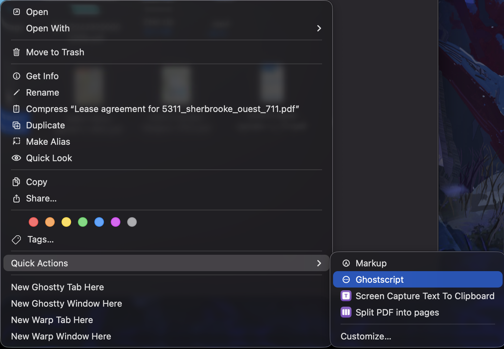
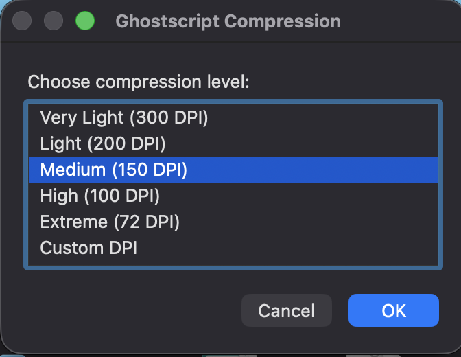
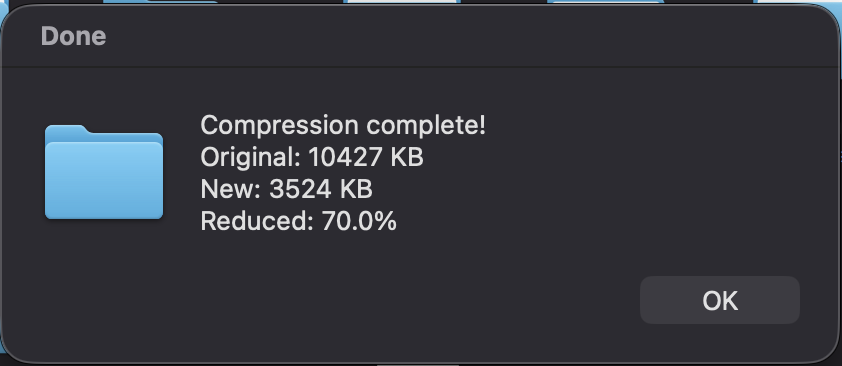

# macOS PDF Compressor (Ghostscript + Automator)

A simple, free, and local PDF compressor for macOS built with:

- **Ghostscript** for high‑quality PDF compression
- **Automator** for a drag‑and‑drop Mac app
- **No uploads, no servers – everything runs locally**

Right Click the PDF file, Select the option, choose a quality level (DPI), pick a name for the compressed file, and you’re done.

---

## Features

- 🖱️ **Ready to Compress** – Just right click the file and select the option
- 🎚️ **Compression levels** – from *Very Light* to *Extreme*, plus a custom DPI option
- 📏 **Preview of savings** – shows original size, new size, and percent reduction
- 🧠 **Smart defaults** – “Medium (150 DPI)” is a great balance of quality and size
- 🔒 **Private & secure** – no internet, no third-party services, runs fully on your Mac
- 💸 **100% free** – Ghostscript is open source; Automator is built into macOS

---

## How it Works (in short)

- The Automator app passes the dropped PDF path to a **zsh script**.
- The script asks you (via AppleScript dialogs):
  - Which **compression level / DPI** you want
  - Where to save the compressed file
- Ghostscript is then run with image downsampling settings:
  - Images are resized to the selected DPI
  - Text/vector quality remains excellent
- At the end, you get a summary dialog:
  - Original size
  - New size
  - Percentage reduction

---

## Requirements

- macOS (Automator + zsh available by default)
- [Optional] Homebrew to install Ghostscript
  You can get Homebrew from:

```text
  https://brew.sh
```

* Ghostscript installed (via Homebrew or another method)

---

## 1. Install Ghostscript

If you’re using **Homebrew**, open **Terminal** and run:

```sh
brew install ghostscript
```

To confirm it’s installed:

```sh
which gs
gs --version
```

Typical paths are:

* Apple Silicon: `/opt/homebrew/bin/gs`
* Intel: `/usr/local/bin/gs`

The script below uses `/opt/homebrew/bin/gs`.
If your `which gs` shows a different path, adjust the script accordingly.

---

## 2. Script Used by Automator

Save this script (or keep it in the repo) as `compress-pdf.sh` or just paste it directly into Automator’s **Run Shell Script** action.

```bash
#!/bin/zsh

# ==================================================
# 1. INPUT FILE (from drag & drop)
# ==================================================
input="$1"

if [[ ! -f "$input" ]]; then
    osascript -e 'display alert "Error: No PDF received. Drag a PDF onto the app icon."'
    exit 1
fi

filename=$(basename "$input")
name="${filename%.*}"
suggested_name="${name}_compressed.pdf"

# ==================================================
# 2. COMPRESSION MENU
# ==================================================
level=$(osascript <<EOF
set choices to {"Very Light (300 DPI)", "Light (200 DPI)", "Medium (150 DPI)", "High (100 DPI)", "Extreme (72 DPI)", "Custom DPI"}
set userChoice to choose from list choices with title "Ghostscript Compression" with prompt "Choose compression level:" default items {"Medium (150 DPI)"}
return userChoice
EOF
)

if [[ "$level" == "false" ]]; then exit 1; fi

dpi=""
pdf_settings=""

case "$level" in
    "Very Light (300 DPI)")
        dpi=300
        # Mild compression, mainly for print‑quality docs
        pdf_settings="/default"
        ;;
    "Light (200 DPI)")
        dpi=200
        # Good balance of size and quality
        pdf_settings="/ebook"
        ;;
    "Medium (150 DPI)")
        dpi=150
        # Stronger compression, still OK for on‑screen reading
        pdf_settings="/ebook"
        ;;
    "High (100 DPI)")
        dpi=100
        # Aggressive compression, mostly for on‑screen
        pdf_settings="/screen"
        ;;
    "Extreme (72 DPI)")
        dpi=72
        # Max compression, smallest files
        pdf_settings="/screen"
        ;;
    "Custom DPI")
        dpi=$(osascript <<EOF
set userInput to text returned of (display dialog "Enter DPI (72–300 recommended)" default answer "150")
return userInput
EOF
)
        # Decide preset based on chosen DPI
        if (( dpi >= 250 )); then
            pdf_settings="/default"
        elif (( dpi >= 150 )); then
            pdf_settings="/ebook"
        else
            pdf_settings="/screen"
        fi
        ;;
esac

# Fallback just in case
[[ -z "$pdf_settings" ]] && pdf_settings="/ebook"

# ==================================================
# 3. SAVE-AS DIALOG
# ==================================================
output=$(osascript <<EOF
set outFile to choose file name with prompt "Save compressed PDF as:" default name "$suggested_name"
POSIX path of outFile
EOF
)

if [[ -z "$output" ]]; then exit 1; fi

outdir=$(dirname "$output")
outfile=$(basename "$output")

# ==================================================
# 4. SHOW PROGRESS WINDOW
# ==================================================
osascript <<EOF &
display dialog "Compressing… Please wait." buttons {} giving up after 120 with title "Ghostscript" with icon note
EOF
progress_pid=$!

# ==================================================
# 5. ORIGINAL SIZE
# ==================================================
orig_size=$(stat -f%z "$input")

# ==================================================
# 6. RUN GHOSTSCRIPT (IMPROVED COMPRESSION LOGIC)
# ==================================================
/opt/homebrew/bin/gs \
    -sDEVICE=pdfwrite \
    -dCompatibilityLevel=1.4 \
    -dPDFSETTINGS=$pdf_settings \
    \
    -dDownsampleColorImages=true \
    -dColorImageDownsampleType=/Bicubic \
    -dColorImageResolution=$dpi \
    -dColorImageDownsampleThreshold=1.0 \
    \
    -dDownsampleGrayImages=true \
    -dGrayImageDownsampleType=/Bicubic \
    -dGrayImageResolution=$dpi \
    -dGrayImageDownsampleThreshold=1.0 \
    \
    -dDownsampleMonoImages=true \
    -dMonoImageDownsampleType=/Subsample \
    -dMonoImageResolution=$dpi \
    -dMonoImageDownsampleThreshold=1.0 \
    \
    -dNOPAUSE -dQUIET -dBATCH \
    -sOutputFile="$output" \
    "$input"

kill "$progress_pid" 2>/dev/null

# ==================================================
# 7. CHECK OUTPUT WORKED
# ==================================================
if [[ ! -f "$output" ]]; then
    osascript -e 'display alert "Compression failed. Ghostscript could not create the output file."'
    exit 1
fi

new_size=$(stat -f%z "$output")
percent=$(echo "scale=1; (1 - $new_size / $orig_size) * 100" | bc -l)
percent=$(printf "%.1f" "$percent")

# ==================================================
# 8. SUCCESS MESSAGE
# ==================================================
osascript <<EOF
display dialog "Compression complete!  
Original: $((orig_size/1024)) KB  
New: $((new_size/1024)) KB  
Reduced: $percent%" buttons {"OK"} with title "Done" with icon note
EOF
```

---

## 3. Setting It Up in Automator (macOS App)


1. Open **Automator** (use Spotlight: `⌘ + Space` → type “Automator”).
2. Click **New Document**.
3. Choose **Application**: `Quick Action`
   * Select **Workflow receives current**: `PDF Files`
   * Select **in**: `Finder`
   * Select **Image**: `Action`
4. In the left sidebar, search for **Run Shell Script**.
5. Drag **Run Shell Script** into the workflow area.
6. At the top of the action:
   * Select **Shell**: `/bin/zsh`
   * Select **Pass input**: `as arguments`
7. Paste the entire script from above into the text area.
8. Save the application.

---

## 4. How to Use

1. Select the PDF file. **Right click** and navigate `Quick Actions` -> `<Your saved application name>`
2. In the **compression menu**, choose:

   * Very Light (300 DPI)
   * Light (200 DPI)
   * Medium (150 DPI) – *recommended default*
   * High (100 DPI)
   * Extreme (72 DPI)
   * Or **Custom DPI**
3. Choose where to **save the compressed PDF** and confirm the name.
4. A small **“Compressing… Please wait.”** dialog appears while Ghostscript runs.
5. When done, you get a dialog like:

   ```text
   Compression complete!
   Original: 12456 KB
   New: 3456 KB
   Reduced: 72.3%
   ```

---

## 5. Compression Levels (DPI Explained)

These presets mainly affect **embedded images** in the PDF:

| Option           | DPI    | Recommended Use                             |
| ---------------- | ------ | ------------------------------------------- |
| Very Light       | 300    | Print-quality documents, good detail        |
| Light            | 200    | General documents with some images          |
| Medium (default) | 150    | Great balance: slides, reports, sharing     |
| High Compression | 100    | Email attachments where size really matters |
| Extreme          | 72     | Web-only viewing, thumbnails, max size cut  |
| Custom DPI       | 72–300 | Fine-tune based on your needs               |

Higher DPI = better image quality, larger files.
Lower DPI = smaller files, but images may look softer when zoomed in.

---

## 6. Security & Privacy

* 🧾 **All processing is local** – the PDF never leaves your machine.
* 🌐 **No network calls** – no uploads, no external services.
* 🧩 **Open source components**:

  * Ghostscript is widely used, open-source software.
  * Automator and zsh are built into macOS.
* 🔐 Good fit for sensitive documents (contracts, IDs, internal reports, etc.)

You can inspect or modify the script yourself at any time – there’s no hidden behavior.

---

## 7. Troubleshooting

### `zsh: command not found: gs`

Automator doesn’t always see the same `PATH` as your Terminal.

* Run in Terminal:

  ```sh
  which gs
  ```

* Update this line in the script:

  ```bash
  /opt/homebrew/bin/gs \
  ```

  to match the path returned, e.g.:

  ```bash
  /usr/local/bin/gs \
  ```

or use the `PATH` export method described earlier.

---



---



---


